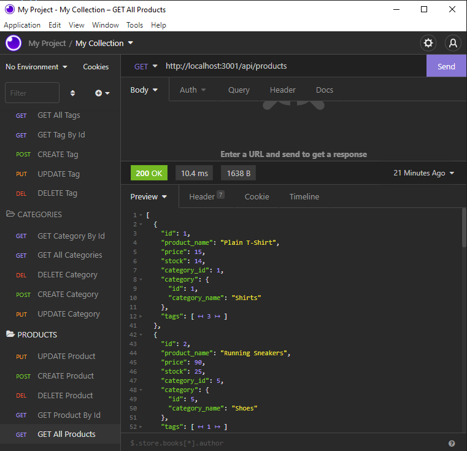
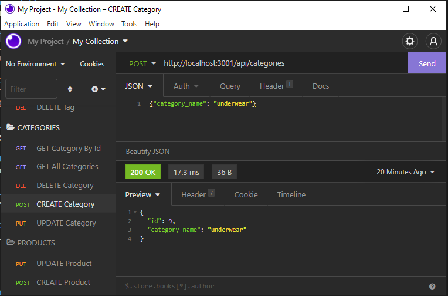

# E-Commerce-BE [](https://opensource.org/licenses/MIT)

  ## Description

   Building the back end for an e-commerce site by modifying starter code by configuring a working Express.js API to use Sequelize to interact with a MySQL database.

   A link to a walkthrough video that demonstrates the functionality of the app is here: [video](https://drive.google.com/file/d/1mQMIiTbUo1AEg4o9DBiuDOZN-13wxLol/view)

```md
    AS A manager at an internet retail company
    I WANT a back end for my e-commerce website that uses the latest technologies
    SO THAT my company can compete with other e-commerce companies
```

  ## Tables of Contents
  * [Instalation](#instalation)
  * [Usage](#usage)
  * [License](#license)
  * [Contributing](#contributing)
  * [Tests](#tests)
  * [Questions](#questions)
   
  ## Instalation

The user should clone the repository from GitHub. This application requires Node.js, Express and sequelize. To start application run npm start.

Use Insomnia to test the api routes.

  ## Usage
  - Getting all products through product route

   

  - Creating a new Category

   
  
  ## License
   For information about this license visit: [MIT](https://opensource.org/licenses/MIT)

  ## Contributing
 No contribution needed.

  ## Tests
   
   Using Insomnia, test the CRUD operations (GET, POST, PUT, and DELETE routes) for categories, products, and tags.

  ## Questions
  My GitHub link: [samer-balee](https://github.com/samer-balee)

  If you have any questions, please e-mail me at samerbalee@gmail.com